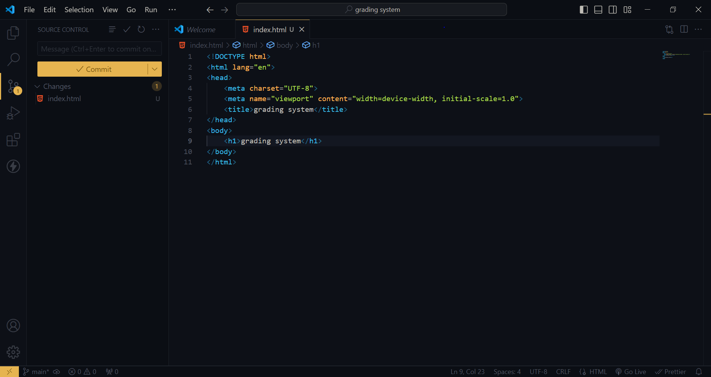
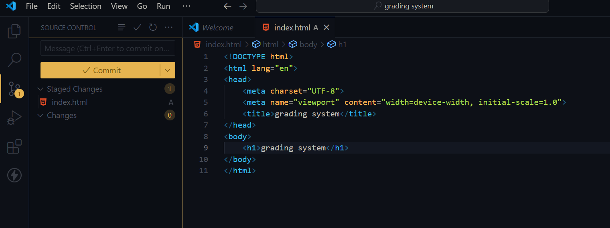
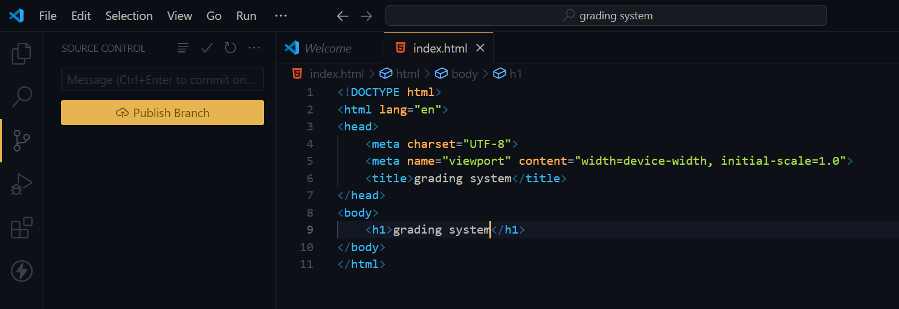
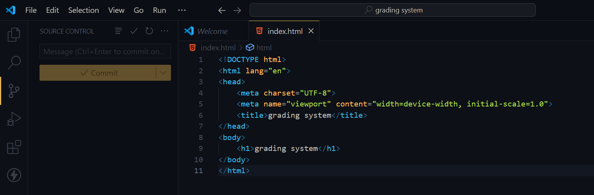
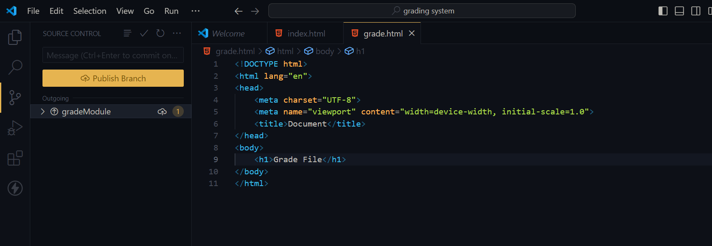
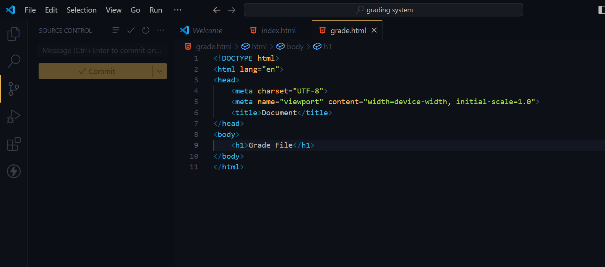
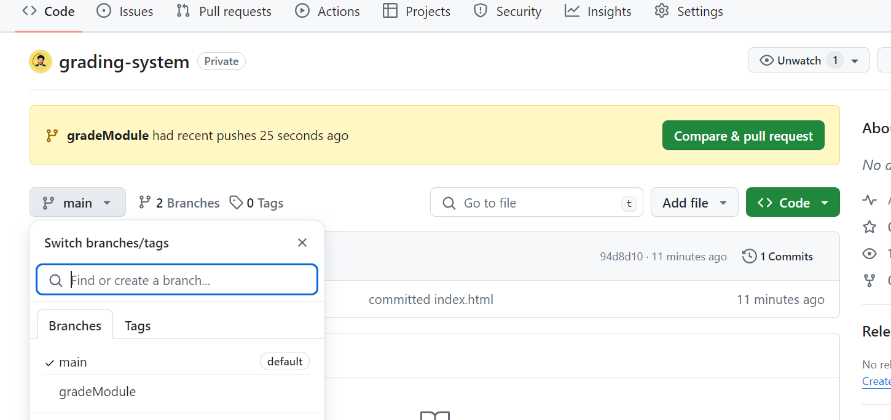
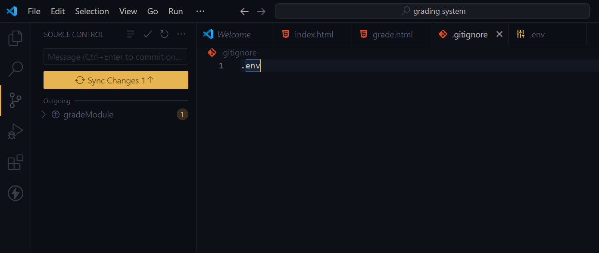
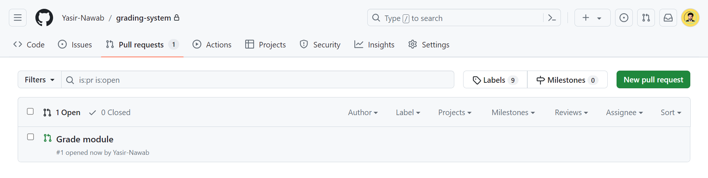

### Name: Yasir Ali
### Section: B
### Reg.NO: 4343/FBAS/BSSE/F21

# GRADING SYSTEM
1. Repo Initialized
   ;

2. changes staged
   ;
3. commit changes
   ;
4. published github repo
   ;
5. new branch created "gradModule"
   ;
6. staged and commited changes in gradModuleBranch
   ;
7. pushed "gradModule" branch
 ;
 ;
8. add ".gitignore" and commit changes
    ;
9. pull request sent
 ;